_From simple triggers to intelligent automation orchestration_

---

n8n has evolved from a simple automation tool into a powerful orchestration platform for AI-driven workflows. Yet most engineers barely scratch its surface, building linear, brittle automations that break at the first edge case.

What if I told you that with the right patterns, you could build self-healing, intelligent automation systems that rival enterprise-grade solutions?

Let's explore 10 battle-tested patterns that will transform how you think about automation architecture.

## Our Running Example: The AI Content Intelligence System

Throughout this article, we'll build pieces of an **AI-powered content intelligence system** that:

- Monitors multiple platforms (Twitter, LinkedIn, Medium)
- Analyzes content with LLMs
- Generates insights and engagement predictions
- Stores structured data for later analysis
- Sends intelligent notifications

Think of it as your personal content radar with AI superpowers.

---

## Pattern 1: Sub-Workflows - The Microservices of n8n

**The Problem**: Your main workflow has 47 nodes and looks like spaghetti code.

**The Solution**: Break complex logic into reusable sub-workflows.

### Architecture Diagram

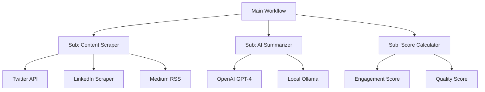

### Quick Implementation Example

**Sub-workflow: "summarize-article"**

1. Create new workflow named `summarize-article`
2. Add `Webhook` trigger (responds to workflow calls)
3. Add `OpenAI` node with prompt: "Summarize this article in 3 bullet points: \{\{$json.content\}\}"
4. Add `Respond to Webhook` node

**Main workflow:**

1. Add `Execute Workflow` node
2. Set workflow name to `summarize-article`
3. Pass article content in the data field

### Real-World Use Case

**Netflix's Content Recommendation Pipeline**: They use similar patterns to break down complex recommendation logic into discrete, testable components - content analysis, user preference modeling, and ranking algorithms each run as separate services.

**Why This Pattern Wins**:

- ✅ Reusable across multiple workflows
- ✅ Easier to test and debug
- ✅ Can be developed by different team members
- ✅ Version control friendly

---

## Pattern 2: The Smart Function Node - Your Data Transformation Hub

**The Problem**: Data comes in messy, goes out messier.

**The Solution**: Use Function nodes as structured data transformation layers.

### Architecture Diagram

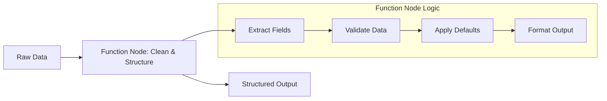

### Quick Implementation Example

```javascript
// Input: Messy article data from various sources
const { title, url, content, platform } = items[0].json;

// Clean and structure
const cleanTitle = title?.trim() || "Untitled";
const slug = cleanTitle
  .toLowerCase()
  .replace(/[^a-z0-9\s-]/g, "")
  .replace(/\s+/g, "-");

return [
  {
    json: {
      title: cleanTitle,
      slug,
      url: url || "",
      content: content?.substring(0, 5000) || "", // Truncate for LLM
      platform: platform?.toLowerCase() || "unknown",
      processedAt: new Date().toISOString(),
      wordCount: content?.split(" ").length || 0,
    },
  },
];
```

### Real-World Use Case

**Stripe's Payment Processing**: Every payment goes through multiple transformation layers - validation, fraud detection, currency conversion, and fee calculation - before final processing.

---

## Pattern 3: Switch Nodes - Your Workflow's Decision Engine

**The Problem**: One size fits all doesn't work for diverse data sources.

**The Solution**: Use Switch nodes to create intelligent routing logic.

### Architecture Diagram

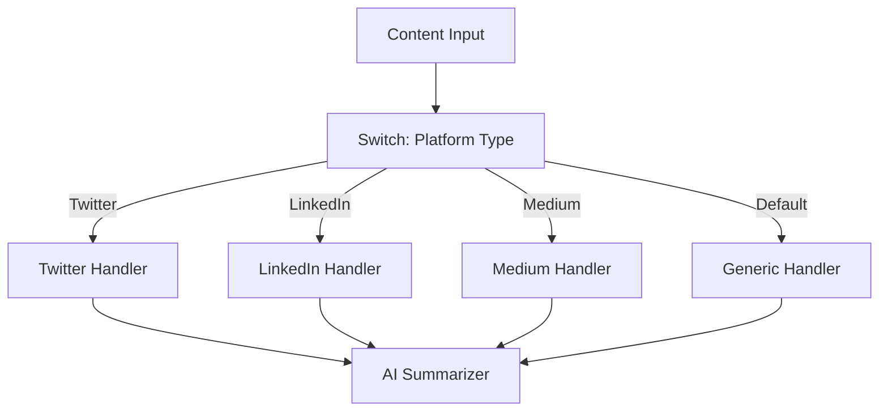

### Quick Implementation Example

**Switch Rules for Platform-Specific Processing:**

1. **Rule 1**: `\{\{ $json.platform \}\}` equals `twitter` → Route to Twitter-specific prompt
2. **Rule 2**: `\{\{ $json.platform \}\}` equals `linkedin` → Route to LinkedIn-specific prompt
3. **Rule 3**: `\{\{ $json.wordCount \}\}` > 1000 → Route to long-form summarizer
4. **Default**: Route to generic handler

### Real-World Use Case

**Shopify's Order Processing**: Different product types (physical, digital, subscription) flow through different fulfillment pipelines, each with specific validation and processing rules.

---

## Pattern 4: Async AI Processing - Handle Slow LLMs Gracefully

**The Problem**: LLM API calls can take 10-60 seconds, blocking your entire workflow.

**The Solution**: Decouple AI processing with async patterns.

### Architecture Diagram

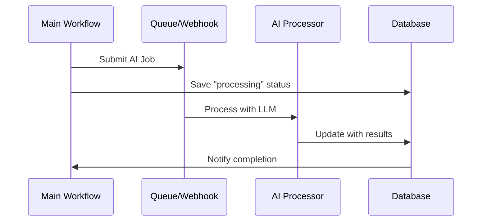

### Quick Implementation Example

**Main Workflow:**

1. `HTTP Request` → Post to webhook with article data
2. `Set` node → Mark status as "processing" in database
3. `Wait` node → Wait for completion webhook

**AI Processing Workflow:**

1. `Webhook` trigger → Receive article data
2. `OpenAI` node → Generate summary (may take 30s)
3. `HTTP Request` → Update database with results
4. `HTTP Request` → Trigger completion webhook

### Real-World Use Case

**OpenAI's ChatGPT**: When you submit a long prompt, it doesn't block the interface. Your request enters a queue, processes asynchronously, and streams results back when ready.

---

## Pattern 5: Configuration as Data - The Lookup Table Pattern

**The Problem**: Hardcoded values scattered throughout your workflow.

**The Solution**: Centralize configuration in data structures.

### Architecture Diagram

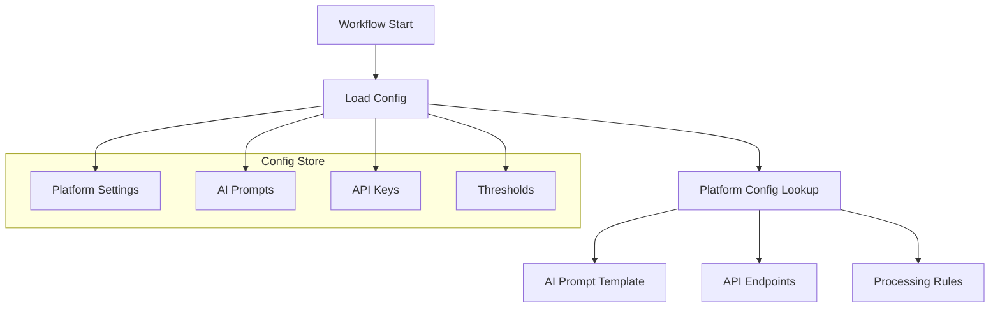

### Quick Implementation Example

**Static Data Node Configuration:**

```json
{
  "platforms": {
    "twitter": {
      "prompt": "Summarize this tweet thread for busy executives",
      "maxLength": 280,
      "aiModel": "gpt-3.5-turbo"
    },
    "medium": {
      "prompt": "Extract key insights from this long-form article",
      "maxLength": 5000,
      "aiModel": "gpt-4"
    },
    "linkedin": {
      "prompt": "Summarize this professional post with actionable takeaways",
      "maxLength": 1300,
      "aiModel": "gpt-3.5-turbo"
    }
  },
  "thresholds": {
    "highEngagement": 100,
    "viralContent": 1000
  }
}
```

### Real-World Use Case

**Kubernetes ConfigMaps**: Instead of hardcoding environment variables in every container, Kubernetes uses ConfigMaps to centrally manage application configuration.

---

## Pattern 6: Intelligent Prompt Engineering - Prompts as Code

**The Problem**: Prompts buried in nodes, impossible to version or A/B test.

**The Solution**: Treat prompts as versioned, templated components.

### Architecture Diagram

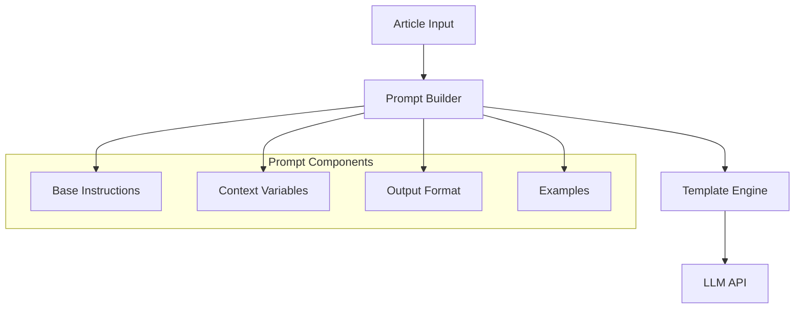

### Quick Implementation Example

**Function Node - Dynamic Prompt Builder:**

```javascript
const { title, content, platform, wordCount } = items[0].json;

// Select template based on content type
const templates = {
  short: "Summarize in 2 sentences",
  medium: "Provide 3 key takeaways",
  long: "Create executive summary with action items",
};

const template =
  wordCount < 500 ? "short" : wordCount < 2000 ? "medium" : "long";

const prompt = `
${templates[template]}

Article: "${title}"
Platform: ${platform}
Content: ${content}

Format: JSON with keys: summary, keyPoints, actionItems
`;

return [{ json: { prompt } }];
```

### Real-World Use Case

**GitHub Copilot**: Uses sophisticated prompt engineering with context about your codebase, current file, and coding patterns to generate relevant suggestions.

---

## Pattern 7: Bulletproof Error Handling - Failing Gracefully

**The Problem**: One API failure kills your entire automation.

**The Solution**: Build resilient error handling at every layer.

### Architecture Diagram

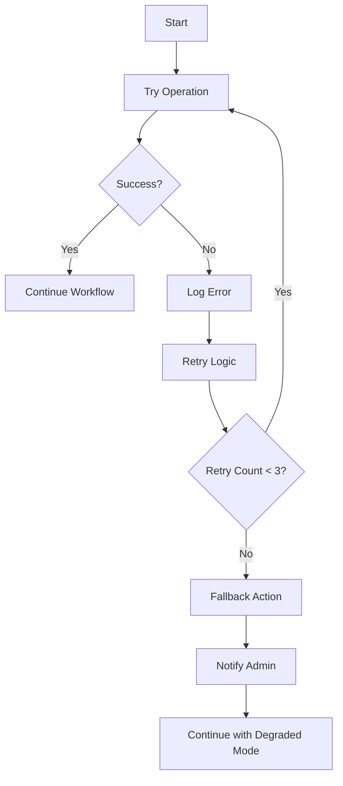

### Quick Implementation Example

**Error Handling Workflow:**

1. `IF` node → Check if API response is successful
2. **Success Path**: Continue to next step
3. **Error Path**:
   - `Set` node → Increment retry counter
   - `IF` node → Check retry count < 3
   - `Wait` node → Exponential backoff (5s, 10s, 20s)
   - `HTTP Request` → Send error to Slack
   - `Set` node → Default/fallback data

### Real-World Use Case

**Netflix Streaming**: When a CDN fails, Netflix automatically routes to backup servers, degrades video quality if needed, and continues streaming rather than showing an error.

---

## Pattern 8: Batch Processing - Handle Scale Like a Pro

**The Problem**: Processing 1,000 articles one by one takes forever.

**The Solution**: Smart batching with parallel processing.

### Architecture Diagram

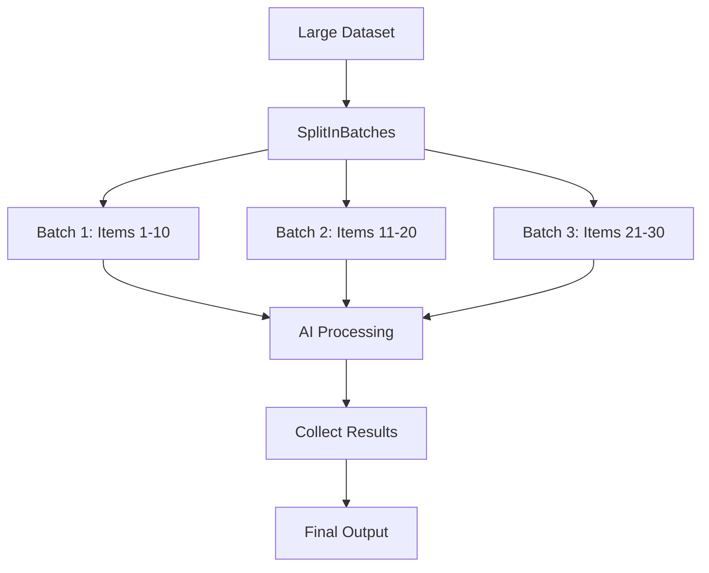

### Quick Implementation Example

**Batch Processing Setup:**

1. `SplitInBatches` node → Set batch size to 10
2. `Function` node → Process each batch item
3. `OpenAI` node → Summarize batch (combine prompts)
4. `Merge` node → Combine all batch results

**Function Node for Batch Processing:**

```javascript
// Process items in current batch
const batchItems = items.map((item) => ({
  title: item.json.title,
  content: item.json.content.substring(0, 1000), // Truncate for batch processing
}));

// Create combined prompt for batch
const combinedPrompt = `
Summarize these ${batchItems.length} articles:
${batchItems.map((item, i) => `${i + 1}. ${item.title}: ${item.content}`).join("\n")}

Return JSON array with summaries.
`;

return [{ json: { prompt: combinedPrompt, batchSize: batchItems.length } }];
```

### Real-World Use Case

**Stripe's Payment Processing**: Instead of processing payments one at a time, they batch similar transactions and process them in parallel, reducing processing time from minutes to seconds.

---

## Pattern 9: Stateful Workflows - Memory That Persists

**The Problem**: Your workflow forgets everything between runs.

**The Solution**: External state management with databases.

### Architecture Diagram

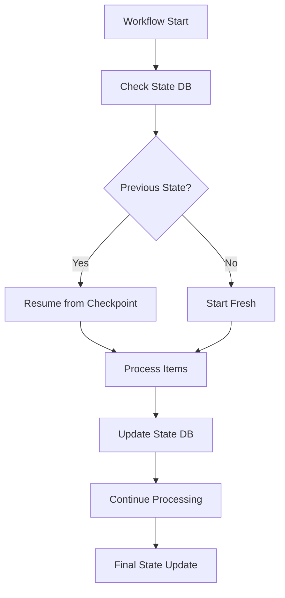

### Quick Implementation Example

**State Management with PostgreSQL:**

```sql
-- Create state table
CREATE TABLE workflow_state (
    id SERIAL PRIMARY KEY,
    workflow_name VARCHAR(100),
    last_processed_id INT,
    status VARCHAR(50),
    metadata JSONB,
    updated_at TIMESTAMP DEFAULT NOW()
);
```

**n8n Workflow:**

1. `Postgres` node → Query current state
2. `IF` node → Check if resuming or starting fresh
3. **Processing Loop** → Process items starting from last checkpoint
4. `Postgres` node → Update state after each batch

### Real-World Use Case

**Airbnb's Data Pipeline**: They process millions of booking events daily, using checkpointing to resume from failures without reprocessing completed data.

---

## Pattern 10: Human-in-the-Loop - AI with Human Oversight

**The Problem**: AI makes mistakes, especially with nuanced content.

**The Solution**: Strategic human checkpoints for quality control.

### Architecture Diagram

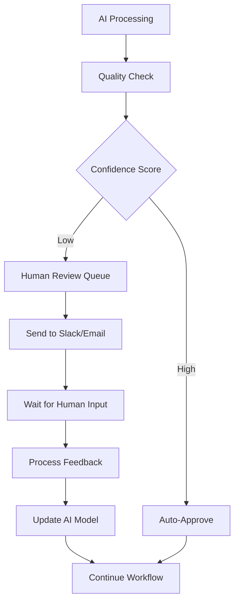

### Quick Implementation Example

**Human Review Workflow:**

1. `Function` node → Calculate confidence score
2. `IF` node → Check if confidence > 0.8
3. **Auto-approve Path**: Continue workflow
4. **Human Review Path**:
   - `Slack` node → Send review request
   - `Wait` node → Wait for webhook response
   - `Function` node → Process human feedback
   - `Postgres` node → Log feedback for model improvement

### Real-World Use Case

**Content Moderation at Scale**: Facebook uses AI to flag potentially harmful content, but humans review edge cases and provide feedback to improve the AI system.

---

## Putting It All Together: The Complete AI Content Intelligence System

Here's how these patterns combine into a production-ready system:

### Full System Architecture

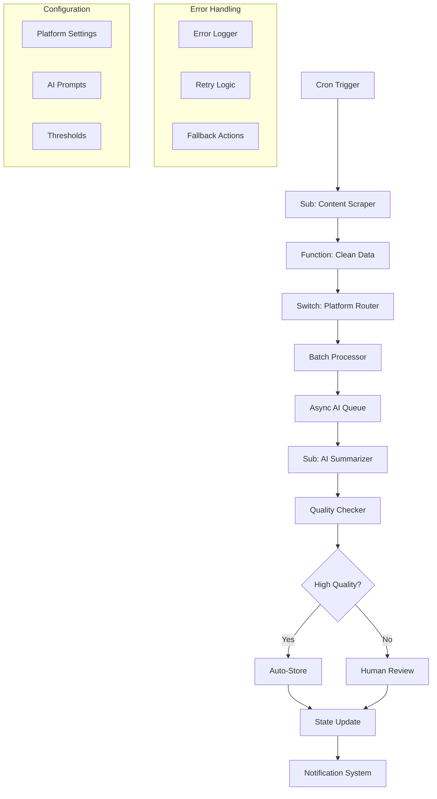

### Key Implementation Insights

**1. Start Simple, Scale Smart**

- Begin with linear workflows
- Identify bottlenecks and repetition
- Apply patterns incrementally

**2. Error Handling is Non-Negotiable**

- Every external API call needs error handling
- Implement exponential backoff
- Always have fallback strategies

**3. Configuration as Code**

- Store settings in version control
- Use environment variables for secrets
- Make prompts easily editable

**4. Monitor Everything**

- Track execution times
- Monitor error rates
- Measure AI quality metrics

---

## Advanced Tips for Production Systems

### 11. Cost Control for AI APIs

```javascript
// Token estimation before API call
const estimatedTokens = Math.ceil(content.length / 4);
const estimatedCost = estimatedTokens * 0.002; // GPT-4 pricing

if (estimatedCost > maxCostPerRequest) {
  return [{ json: { error: "Content too expensive to process" } }];
}
```

### 12. A/B Testing Your Prompts

Use Switch nodes to randomly route requests to different prompt versions, then measure quality metrics.

### 13. Self-Healing Workflows

Implement automatic retry logic with exponential backoff and circuit breakers for failing services.

### 14. Observability Stack

- Prometheus metrics for performance
- Grafana dashboards for visualization
- Slack alerts for critical failures

### 15. Version Control Integration

Export workflows as JSON and track them in Git for proper DevOps practices.

---

## Conclusion: From Automation to Intelligence

These patterns transform n8n from a simple automation tool into an intelligent orchestration platform. By combining them thoughtfully, you create systems that are:

- **Resilient**: Handle failures gracefully
- **Scalable**: Process thousands of items efficiently
- **Maintainable**: Clean, modular, and testable
- **Intelligent**: Adapt behavior based on context and feedback

The future of automation isn't just about connecting APIs—it's about building systems that learn, adapt, and make intelligent decisions.

Start with one pattern. Master it. Then gradually compose them into increasingly sophisticated systems.

Your automation journey from simple triggers to AI-powered intelligence starts now. 🚀

---

_Ready to implement these patterns? Start with Pattern 1 (Sub-Workflows) and work your way up. Each pattern builds on the previous ones, creating a solid foundation for intelligent automation._
