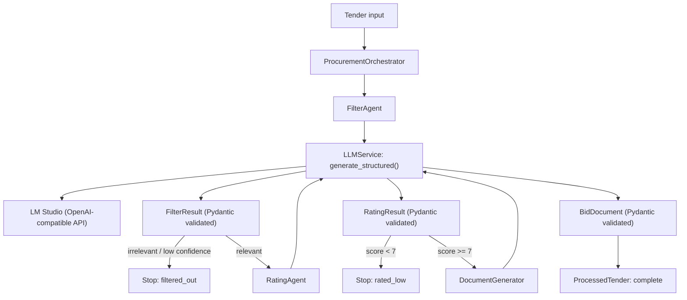

## Why I Built This

Most LLM tutorials teach you to write prompts. This one teaches you to write **systems**.

After years building software at Société Générale, Airbus, and Volvo Cars, I know what separates demos from production: contracts, validation, and error handling. When I started learning LLM engineering, I wanted to skip the "magical textbox" phase and go straight to treating models like any other API.

So I built a one-file procurement analyst that actually works—not as a demo, but as a system with real constraints.

It does three things:

1. **Filters** tenders for relevance (cybersecurity / AI / software)
2. **Rates** the opportunity (fit, win probability, effort, risks)
3. **Generates** structured bid content (executive summary, approach, value prop, timeline)

All of it runs locally through **LM Studio** using an OpenAI-compatible API. The model is forced to return **structured JSON validated with Pydantic**, so downstream code stays clean and predictable.

This article documents the approach, the architecture, and the LLM engineering patterns that made it reliable.

---

## Why Procurement Makes a Great Learning Project

Procurement tenders are an underrated playground for applied LLM engineering:

- Inputs are messy: long descriptions, vague requirements, inconsistent formatting
- Outputs have business impact: go/no-go decisions, prioritization, drafting bids
- Constraints are strict: you need repeatable scoring and consistent structure
- There’s a natural workflow: **filter → evaluate → generate**

And from a learning perspective, it forces you to handle the real problems of
LLM apps:

- structured outputs
- retries
- temperature control
- orchestration
- guardrails & branching logic

---

## The MVP in one sentence

> A sequential, multi-agent pipeline that turns a tender into a validated
> decision and draft bid content, with structured JSON enforced via Pydantic.

---

## The core design choice: treat the LLM like software, not a chatbot

If you’re new to LLM engineering, here’s the first trap:

> You call the model. You get back text. You try to parse it. It breaks.
> You add more prompts. It breaks differently.

The upgrade is to treat the model output as a **contract**.

This MVP uses **Pydantic models** as that contract:

- The model must return JSON.
- The JSON must match a schema.
- Values must fall within constraints.
- If anything is wrong, we retry.

That’s not “prompting.” That’s engineering.

---

## The architecture (simple, but teachable)

This app is layered in a way that mirrors production systems:

- **Schema layer**: Pydantic models describing expected outputs
- **LLM infrastructure layer**: one service that does API calls + cleaning + validation
- **Agent layer**: business logic prompts (filter, rate, generate)
- **Orchestration layer**: branching workflow + status + timing
- **Demo layer**: `main()` runs sample tenders and prints a report

Here’s the flow:



This is a “boring” linear workflow—which is exactly why it’s perfect for learning.
Later, you can compare it to LangGraph or more complex agent routing.
But first, make the basics solid.

---

## Step 1: Define the **schemas** (Pydantic is the backbone)

Let’s start with the most important part: structured outputs.

### A minimal mental model for Pydantic here

Pydantic gives you:

1. **Type enforcement** (float vs string, list vs scalar)
2. **Constraint checking** (confidence must be 0–1, scores must be 0–10)
3. **Parsing into Python objects** you can trust

In this MVP, each agent has a corresponding schema:

- FilterAgent → `FilterResult`
- RatingAgent → `RatingResult`
- DocumentGenerator → `BidDocument`

Here’s the filtering output model:

```python
class FilterResult(BaseModel):
    """Output from Filter Agent"""
    is_relevant: bool = Field(description="Is tender relevant?")
    confidence: float = Field(description="Confidence 0-1", ge=0, le=1)
    categories: List[TenderCategory] = Field(description="Detected categories")
    reasoning: str = Field(description="Explanation for decision")
```

That `ge=0, le=1` is not decoration.
It’s the difference between “confidence = 0.92” and “confidence = 9.2” breaking your system silently.

Here’s the rating model (multi-dimensional scoring, strengths, risks):

```python
class RatingResult(BaseModel):
    overall_score: float = Field(description="Score 0-10", ge=0, le=10)
    strategic_fit: float = Field(description="Fit score 0-10", ge=0, le=10)
    win_probability: float = Field(description="Win chance 0-10", ge=0, le=10)
    effort_required: float = Field(description="Effort 0-10", ge=0, le=10)
    strengths: List[str] = Field(description="Top 3 strengths")
    risks: List[str] = Field(description="Top 3 risks")
    recommendation: str = Field(description="Go/No-Go with reasoning")
```

And the bid content model:

```python
class BidDocument(BaseModel):
    executive_summary: str = Field(description="2-3 paragraph summary")
    technical_approach: str = Field(description="How we'll solve it")
    value_proposition: str = Field(description="Why choose us")
    timeline_estimate: str = Field(description="Project timeline")
```

This is the “contract” mindset:

> Don’t accept vague prose. Accept validated data.

---

## Step 2: Build a single “structured output” LLM gateway

Most early LLM prototypes scatter API calls all over the code.
That becomes untestable fast.

Instead, this MVP centralizes the LLM interaction in one class: `LLMService`.

The key method is the heart of the system:

```python
async def generate_structured(
    self,
    prompt: str,
    response_model: BaseModel,
    system_prompt: str,
    temperature: float = 0.1,
    max_retries: int = 3,
) -> BaseModel:
```

This method demonstrates a production-grade pattern:

1. Build messages (system + user)
2. Inject schema guidance into the user prompt
3. Call the LLM API (LM Studio)
4. Clean the response (remove code fences, extract JSON)
5. Parse JSON
6. Validate with Pydantic
7. Retry if anything fails

### Prompt-time schema steering (simple and effective)

This MVP doesn’t use function calling. Instead it uses **example-driven JSON steering**.

The user prompt is built like this:

```python
messages = [
    {"role": "system", "content": system_prompt},
    {"role": "user", "content": self._build_structured_prompt(prompt, response_model)},
]
```

Then `_build_structured_prompt()` injects:

- an example JSON object with correct types
- strict formatting rules
- constraints (confidence 0–1, scores 0–10, enum values, lists required)

A snippet:



```python
return f"""{prompt}

You must respond with ACTUAL DATA in JSON format, not a schema.

Here's the expected format with CORRECT value types:
{example_json}

CRITICAL VALUE REQUIREMENTS:
- confidence: Use decimal 0-1 (like 0.95, not 9.5)
- Categories: Use EXACT enum values: "cybersecurity", "ai", "software", "other" (lowercase)
- Scores: Use numbers 0-10 (like 8.5)
- Arrays: Use actual lists with 3 items for strengths/risks
- All text fields: Provide meaningful actual content

FORMATTING RULES:
- Start with {{ and end with }}
- No explanations before or after JSON
- No code blocks or backticks"""
```



This might look verbose, but it’s teaching the model how to behave.

When I’m learning, I prefer **explicit guardrails** over “clever” prompts.

---

## Step 3: Clean and validate (the reliability layer)

Even good models occasionally return:

- Markdown fences: `json …`
- commentary before/after JSON
- incomplete objects
- extra braces in reasoning text

So the MVP includes `_clean_json()` to strip markdown and extract the first balanced JSON object.

This is one of those “unsexy” details that separates a demo from a working app.

````python
def _clean_json(self, text: str) -> str:
    cleaned = text.strip()

    # Remove markdown code blocks
    if cleaned.startswith("```json"):
        cleaned = cleaned[7:]
    elif cleaned.startswith("```"):
        cleaned = cleaned[3:]
    if cleaned.endswith("```"):
        cleaned = cleaned[:-3]

    cleaned = cleaned.strip()

    # Find the JSON object by looking for balanced braces
    start_idx = cleaned.find('{')
    if start_idx == -1:
        return cleaned

    brace_count = 0
    end_idx = -1

    for i, char in enumerate(cleaned[start_idx:], start_idx):
        if char == '{':
            brace_count += 1
        elif char == '}':
            brace_count -= 1
            if brace_count == 0:
                end_idx = i
                break

    if end_idx != -1:
        return cleaned[start_idx:end_idx + 1]

    return cleaned
````

### The two-stage validation gate

The method then does:

1. `json.loads(cleaned)`
2. `response_model.model_validate(parsed)`

That second step is where Pydantic enforces correctness.

If anything fails, we retry:

```python
for attempt in range(max_retries):
    try:
        response = await self._call_api(messages, temperature)
        cleaned = self._clean_json(response)

        if not cleaned.startswith('{') or not cleaned.endswith('}'):
            raise ValueError("Response doesn't look like JSON")

        parsed = json.loads(cleaned)
        return response_model.model_validate(parsed)

    except Exception as e:
        if attempt == max_retries - 1:
            raise Exception(f"Failed after {max_retries} attempts: {e}")
        await asyncio.sleep(2)
```

This gives you a stable contract:

- if you get a result, it matches the schema
- if not, it fails loudly and predictably

---

## Step 4: The agents (business logic as prompts)

With the infrastructure in place, the agents become clean and readable.

### Agent 1: FilterAgent (classification + reasoning)

The filtering agent answers: “Do we care?”

Key design choice: low temperature.

```python
system = "You are an expert procurement analyst specializing in technology tenders. Be precise and conservative."

return await self.llm.generate_structured(
    prompt=prompt,
    response_model=FilterResult,
    system_prompt=system,
    temperature=Config.TEMPERATURE_PRECISE,
)
```

The prompt includes explicit criteria:

- relevant if it involves cybersecurity / AI / software development
- not relevant if hardware, physical infra, catering, etc.

This is a classification prompt with reasoning, not “generate content.”

---

### Agent 2: RatingAgent (multi-dimensional scoring)

This is where you start seeing “LLM as analyst.”

The prompt asks for:

- strategic fit
- win probability
- effort required
- strengths and risks
- go/no-go recommendation

And again: low temperature.

```python
system = "You are a business development expert evaluating tender opportunities. Be analytical and realistic, not optimistic."
```

The output is forced into `RatingResult`, so the orchestrator can branch on:

```python
if result.rating_result.overall_score < 7.0:
    result.status = "rated_low"
    return result
```

That branch is important: it’s cost control and quality control.

---

### Agent 3: DocumentGenerator (creative, but constrained)

Now we increase temperature for writing:

```python
temperature=Config.TEMPERATURE_CREATIVE
```

But we still constrain the output via `BidDocument`.

This is an important lesson:

> Creativity does not mean unstructured.

Even “creative generation” should land in a contract if you plan to automate anything downstream.

---

## Step 5: Orchestration (where this becomes a “product workflow”)

The orchestrator ties everything into a coherent pipeline.

It does four jobs:

1. sequential execution
2. branching logic
3. status tracking
4. timing

A key part is the early exit:

```python
if (
    not result.filter_result.is_relevant
    or result.filter_result.confidence < 0.6
):
    result.status = "filtered_out"
    return result
```

Then:

```python
if result.rating_result.overall_score < 7.0:
    result.status = "rated_low"
    return result
```

Finally:

```python
result.bid_document = await self.doc_generator.generate(
    tender, categories, result.rating_result.strengths
)
result.status = "complete"
```

This is “agent orchestration,” but it’s intentionally simple.
You can understand every branch without mental overhead.

That’s a feature.

---

## A quick demo dataset (and why it matters)

The MVP includes sample tenders:

- AI cybersecurity platform (should be relevant + high rated)
- office furniture (should be filtered out)
- custom CRM software (likely relevant)

That gives you immediate feedback on whether your prompts and schema steering are working.

```python
SAMPLE_TENDERS = [
    Tender(...),
    Tender(...),
    Tender(...),
]
```

When you run `main()`, you get a summary report:

- how many were relevant
- how many rated high
- how many documents generated
- processing time

This is the beginning of an evaluation loop.

If you build more samples (including tricky borderline cases), this becomes the foundation of a real test suite.

---

## What I learned (the practical LLM engineering takeaways)

### 1) Structured outputs are not optional

The fastest path to reliability is:

- define schema
- steer model toward JSON
- validate and retry

If you skip validation, your app becomes fragile.

### 2) Prompts become much easier when the schema is clear

When you know the output fields, prompts become focused:

- “Return categories and confidence”
- “Return 3 strengths, 3 risks”
- “Return these four sections”

The schema eliminates ambiguity.

### 3) Temperature is a tool, not a vibe

I used:

- **0.1** for filtering and rating (precision)
- **0.7** for document generation (variation)

It’s not about “better answers.”
It’s about matching the mode to the task.

### 4) Orchestration is where business logic lives

The model does analysis, but the system does decisions:

- exit early if irrelevant
- exit early if low score
- only generate proposals when worth it

That’s a product mindset.

### 5) Debugging LLM apps is mostly debugging output shape

The code includes debug prints on retries:

```python
if attempt > 0:
    print(f"    Raw response: {response[:200]}...")
    print(f"    Cleaned: {cleaned[:200]}...")
```

This is extremely useful early on because most failures are formatting / schema mismatch.

---

## What I Learned Building This

**The one-file constraint forced every decision to be defensible.** When you can't hide complexity in microservices, every abstraction becomes obvious. Is this validation really needed? Is this retry logic correct? You can't defer those questions. That clarity is valuable—keep it as long as possible before splitting things up.

**Prompt engineering is 20% of the work; output validation is 80%.** Most tutorials stop after "look, the LLM gave me an answer!" The real engineering starts when you ask: what happens on request 1,001 when the format changes? What happens when confidence is returned as "95%" instead of 0.95? Pydantic catches these before they become production incidents.

**Local LLM development changes the feedback loop completely.** No API costs, no rate limits, instant iteration. I ran this hundreds of times while tuning prompts and schemas. That kind of experimentation would cost hundreds of dollars with cloud APIs. Local-first development for prototyping, then scale to cloud APIs when patterns stabilize.

---

## Resources & Next Steps

**Read the Code**: [github.com/aminrj/procurement-ai](https://github.com/aminrj/procurement-ai) — Tag `v0.1-article-procurement-mvp` for the one-file version

**Follow the Series**:
- Part 2: [Build Production-Ready LLM Agents](/posts/Build-production-ready-llam-agents/)
- Part 3: [From MVP to Production SaaS](/posts/from-mvp-to-prod/)

**Building an LLM Application?** If you're moving from notebooks to production and need architecture guidance on structured outputs, validation strategies, and error handling, [let's talk](/consultation/). I offer a free 30-minute call where we'll review your approach and identify where demos become fragile in production.

Connect with me on [LinkedIn](https://www.linkedin.com/in/aminrjami/), and star the [procurement-ai repository](https://github.com/aminrj/procurement-ai) to see how this evolved from one file to a full application.

Thanks for reading.

---

### Appendix: The most important snippet (the pattern to reuse everywhere)

If you only take one piece from this article, take this pattern:

```python
# 1) Define schema with Pydantic
class OutputModel(BaseModel):
    field_a: str
    score: float = Field(ge=0, le=10)

# 2) Call LLM and force JSON shape
result = await llm.generate_structured(
    prompt="Do the task and return JSON.",
    response_model=OutputModel,
    system_prompt="Be precise.",
    temperature=0.1,
)

# 3) Now you have a validated object, not messy text
print(result.score)
```

That’s the foundation of LLM engineering.
